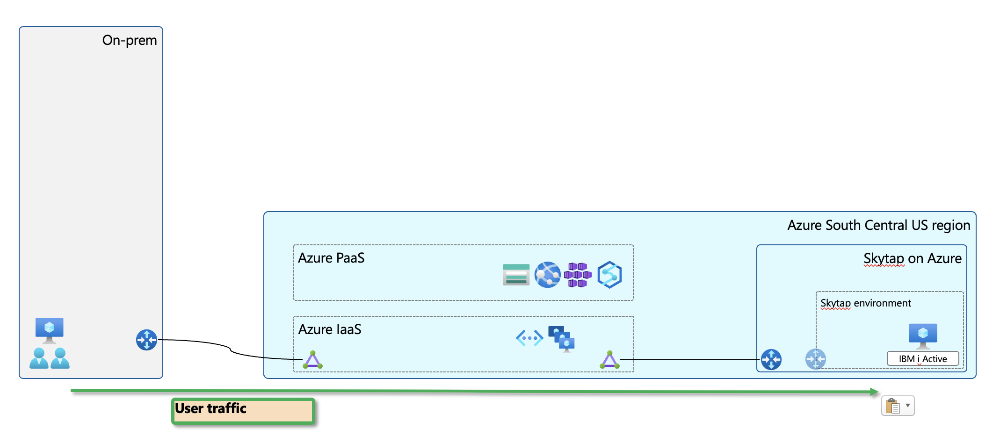
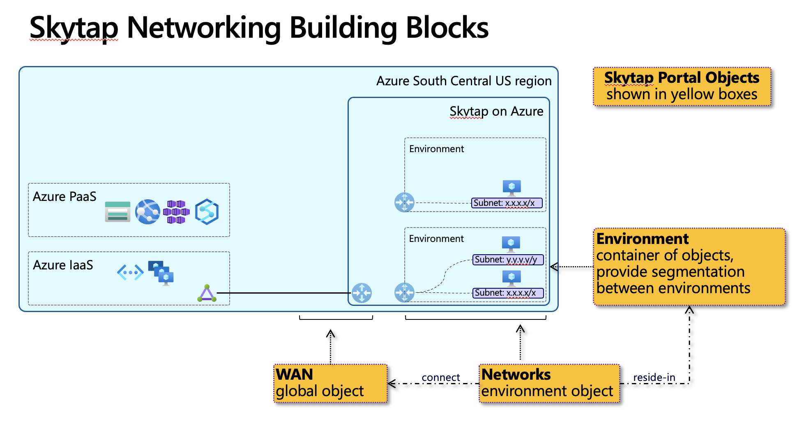
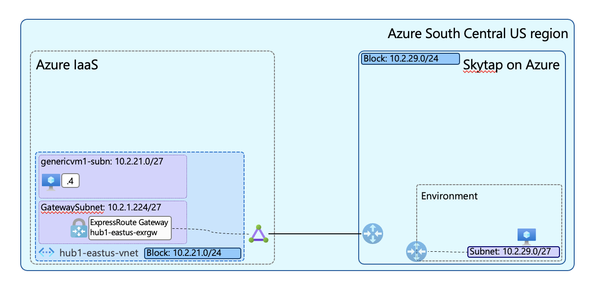

# Skytap on Azure networking overview and basic connectivity

This article summarize basic connectivity between Azure and Skytap over ExpressRoute with scripts to set up a test environment. It complements [networking section of Skytap documentation](https://help.skytap.com/network-overview.html) and focus on connectivity components in Azure.

You can read about Skytap on Azure in [this press release](https://www.skytap.com/press-releases/skytap-on-azure-publicly-available/).

Services, including parts of ExpressRoute connectivity in Skytap on Azure is managed by Skytap portal, accessible after registering Skytap application object in an Azure Subscription. This document assumes you already have access to Skytap portal. The registration process is out of scope of this document.

# Connectivity with Skytap on Azure

Skytap on Azure infrastructure resides within the same physical Azure data center with Microsoft Enterprise Edge (MSEE) routers providing connectivity over Azure ExpressRoute to the broader Azure services as well as on-premise networks



# Building blocks of Skytap networking

Skytap utilize its own software-defined network infrastructure, driven by following configuration objects from the Skytap portal:

- Environment
  - Container of objects, mainly VMs and Networks
  - Provides boundary between different systems (more on this later)
- Networks
  - Describe configuration of subnets and its behavior
  - A point of connection for VM interfaces
  - There can be multiple networks in an environment
- WAN
  - Describe configuration of external connectivity: ExpressRoute or VPN (out of scope of this article)
  - A point of connection for Networks in 1:many relationship

Notes from the diagram: Router icons in Skytap environments are internal logical components not visible to the user. They are managed as part of above objects. Presented here for context for traditional networking audiences. This will be revisited in future articles.



# About routing between networks

Within an environment, routing between network is blocked by default. [This document](https://help.skytap.com/routing-between-networks-in-the-same-environment.html) describe steps to turn it on.

Routing between environments, can be done by using  Inter-Configuration Network Routing (ICNR) as detailed in [this page](https://help.skytap.com/connecting-multiple-environments.html).

# Exercise: Making ExpressRoute connection to Skytap

This exercise walks you through the steps of making basic ExpressRoute connection between Azure VNET to a Skytap Environment with Linux VMs to verify the connectivity.

At the end of this exercise you will have a working connectivity between VMs in Azure and Skytap.

Skytap offers choices of how an ExpressRoute circuit is created:
- Skytap-provided ExpressRoute circuit
- Customer-provided ExpressRoute circuit

Each option differs where the circuit is billed and creation steps. This article uses customer-provided ExpressRoute circuit.



This article assumes there is already an environment with a VM in Skytap. Please see refer to [this Skytap tutorial](https://help.skytap.com/getting-started.html) to create one.

## Step 1: Create and connect ExpressRoute to Skytap

First, create ExpressRoute circuit in Azure and collect [Service Key] to complete connection from Skytap side.

[Provider] and [Peering Location] parameters can be found in [This Skytap help article](https://help.skytap.com/wan-create-self-managed-expressroute.html).

``` bash
# set variables - apply to all steps in this article
REGION="southcentralus"
RGNAME="skytaplab-rg"
HUBVNET_NAME="hub1-scus-vnet"

# create resource group
az group create --location=$REGION --resource-group=$RGNAME

# create ExpressRoute circuit to Skytap
# for East US, use this parameters. Provided for reference.
# az network express-route create --resource-group=$RGNAME --location="eastus" --bandwidth="50 mbps" --name="pnlab-toskytap1-eastus-exr" --provider="Skytap Prod" --peering-location="Washington DC" --sku-tier="Standard" --sku-family="MeteredData" --allow-global-reach="True"

# for South Central US:
az network express-route create --resource-group=$RGNAME --location="southcentralus" --bandwidth="50 mbps" --name="pnlab-toskytap1-scus-exr" --provider="SkytapInDC Prod" --peering-location="SouthCentralUS SAT09 Skytap" --sku-tier="Standard" --sku-family="MeteredData" --allow-global-reach="True"
```

Confirm provisioning state from Azure side and get service key. Note that serviceProviderProvisioningState is "NotProvisioned" at this point.

``` bash
az network express-route show --resource-group=$RGNAME --name="pnlab-toskytap1-scus-exr" --query="{Name:name,ProvisioningState:provisioningState,serviceProviderProvisioningState:serviceProviderProvisioningState,serviceKey:serviceKey}" --output=jsonc
```

The output should look like this

``` bash
{
  "Name": "pnlab-toskytap1-scus-exr",
  "ProvisioningState": "Succeeded",
  "serviceKey": "455cfcdd-92a2-4c73-a891-75256e0e525a",
}
```

Take note the service key for next step.

## Step 2: Create and connect WAN from Skytap side

This part of configuration to be done in Skytap portal.

For detailed procedures please refer to Skytap help article: [Creating a customer-managed ExpressRoute circuit for a Skytap on Azure ExpressRoute connection](https://help.skytap.com/wan-create-self-managed-expressroute.html)

1. Create WAN object with following parameters
    - Skytap Menu: MANAGE > WANs > New ExpressRoute
    - Name: give it an appropriate name
    - Region: pick appropriate region the same as previously provisioned ExpressRoute circuit
    - Connection type: Customer-managed circuit
    - Service key: paste service key from previous output
    - Skytap peer IP: pick a public IP address or create one if needed
    - Apply NAT for connecting networks: keep off for this exercise
    - Skytap subnet: 10.2.29.0/24 - this needs to be the same or supernet of connecting Skytap environment

2. Add remote subnets
    - from the result screen of creating 
    - this is the subnets on the other side of Skytap WAN connection, in this case 10.2.21.0/24

    After few minutes, [Provisioning state] in Skytap WAN configuration page should show as "Provisioned". You may need to refresh the browser.
    
    ExpressRoute circuit on Azure side should show serviceProviderProvisioninState as "Provisioned".

    ``` bash
    # query Service Provider Provisioning (Skytap side) status of the ExpressRoute
    az network express-route show --resource-group=$RGNAME --name="pnlab-toskytap1-scus-exr" --query="{Name:name,ProvisioningState:provisioningState,serviceProviderProvisioningState:serviceProviderProvisioningState,serviceKey:serviceKey}" --output=jsonc
    ```

    Output should show as "Provisioned" if the connection is successful
    
    ``` bash
    {
      "Name": "pnlab-toskytap1-scus-exr",
      "ProvisioningState": "Succeeded",
      "serviceKey": "455cfcdd-92a2-4c73-a891-75256e0e525a",
      "serviceProviderProvisioningState": "Provisioned"
    }
    ```
  
  ExpressRoute connection is now established.

3. Attach a Skytap environment to Skytap WAN
    - refer to Skytap document [Connecting an environment network to a WAN](https://help.skytap.com/wan-connecting-environments.html#additional-information)
    - at least a VM needed to be turned on for route validation
    - come back to Skytap WAN screen. The connected environment will be listed in "Attached networks" tab. Please click [Enable] button to turn on this Skytap WAN

    At this point Azure side of ExpressRoute object should list route learned from Skytap. Note that the learnt route is the [Skytap WAN - Skytap Subnet] value (10.2.29.0/24), and not subnet in Network Settings in the connected Skytap environment (10.2.29.0/27 in this case)

    ``` bash
    # list route table of the ExpressRoute
    # output shows this ExpressRoute circuit has learned route from Skytap
    az network express-route list-route-tables --resource-group=$RGNAME --name="pnlab-toskytap1-scus-exr" --path="primary" --peering-name="AzurePrivatePeering"
    ```

    ``` bash
    # output: shows this ExpressRoute circuit has learned the prefix from our Network in Skytap Environment
    {
      "nextLink": null,
      "value": [
        {
          "locPrf": "100",
          "network": "10.2.29.0/24",
          "nextHop": "169.254.254.1",
          "path": "46160 I\n                    ",
          "weight": 0
        }
      ]
    }
    ```

We have successfully established a routable connectivity between Azure and a Network in Skytap Environment. Let's proceed with connecting this circuit to an ExpressRoute Gateway to allow connectivity to other Azure components - an Azure VM in this case.

## Step 3: Prepare Azure components

1. Create VNET, ExpressRoute Gateway and connect previously created ExpressRoute circuit to the gateway.
    
    TIPS: This step takes about 40 minutes to complete.

    ``` bash
    # create VNET and subnets
    az network vnet create --resource-group=$RGNAME --location=$REGION --name=$HUBVNET_NAME --address-prefixes="10.2.21.0/24" 

    az network vnet subnet create --resource-group=$RGNAME --vnet-name=$HUBVNET_NAME --name="genericvm1-subn" --address-prefixes="10.2.21.0/27"

    az network vnet subnet create --resource-group=$RGNAME --vnet-name=$HUBVNET_NAME --name="GatewaySubnet" --address-prefixes="10.2.21.224/27"

    # create ExpressRoute gateway
    az network public-ip create --resource-group=$RGNAME --location=$REGION --name="hub1-scus-exrgw-pip1" --allocation-method="Dynamic" --sku="Basic"

    az network vnet-gateway create --resource-group=$RGNAME --location=$REGION --name="hub1-scus-exrgw" --vnet=$HUBVNET_NAME --gateway-type="ExpressRoute" --sku="Standard" --public-ip-address="hub1-scus-exrgw-pip1" --no-wait

    # wait until ExR gateway provisioning is completed
    echo "\n"
    echo "#***"
    echo "#*** polling provisionting state of hub1-scus-exrgw every 10 seconds until provisioning is completed."
    echo "#***"
    while [[ $prState != 'Succeeded' ]];
    do
        prState=$(az network vnet-gateway show --resource-group=$RGNAME --name="hub1-scus-exrgw" --query='provisioningState' -o tsv)
        echo "hub1-scus-exrgw provisioningState = "$prState
        sleep 10
    done
    echo "#*** ExpressRoute Gateway provisioning completed."
    ```

    Then proceed to connect ExpressRoute circuit to the ExpressRoute gateway.

    ``` bash
    # connect ExpressRoute circuit to the gateway
    az network vpn-connection create --resource-group=$RGNAME --name="hub1-scus-exrgw_to_pnlab-toskytap1-scus-exr_conn" --vnet-gateway1="hub1-scus-exrgw" --express-route-circuit2="pnlab-toskytap1-scus-exr"
    ```

    VERIFY: ExpressRoute Gateway will learn advertised routes from Skytap.

    ``` bash
    # this command list routes that ExpressRoute gateway learned from its peers
    az network vnet-gateway list-learned-routes --resource-group=$RGNAME --name="hub1-scus-exrgw" --output=table
    ```
    RESULT: Output will show learned address prefix, identical to [Skytap Subnet] configuration.

    ``` bash
    # output: shows routes learned from Skytap, via ExpressRoute circuit
    {
      "value": [
        {
          "asPath": "",
          "localAddress": "10.2.21.237",
          "network": "10.2.21.0/24",
          "nextHop": null,
          "origin": "Network",
          "sourcePeer": "10.2.21.237",
          "weight": 32768
        }
      ]
    }
    ```
    
2. Create a test VM, allow SSH access from your public IP address and verify connectivity

    ``` bash
    VMSIZE="Standard_DS1_v2"
    VMUSERNAME="azureuser"
    VMPASSWORD="Azure123456$"

    # create a small test VM
    az vm create --resource-group $RGNAME --name="azurehubtest1-vm" --image="ubuntults" --public-ip-sku="Standard" --size=$VMSIZE --location=$REGION --vnet-name=$HUBVNET_NAME --subnet="genericvm1-subn" --admin-username=$VMUSERNAME --admin-password=$VMPASSWORD --nsg "" --no-wait

    # set your home IP address to be added to NSG for SSH into VM
    # !! please set this variable manually if running this script in cloud shell
    HOMEPIP=$(curl -4 ifconfig.io -s)

    # create network security group and note the public IP address in the output
    az network nsg create --resource-group=$RGNAME --name="genericvm1-subn-nsg" --location=$REGION

    # adding home public IP to NSG for SSH access
    az network nsg rule create --resource-group=$RGNAME --nsg-name="genericvm1-subn-nsg" --name="allow-home-ssh" --direction="Inbound" --priority="100" --source-address-prefixes=$HOMEPIP --source-port-ranges="*" --destination-address-prefixes="*" --destination-port-ranges="22" --access="Allow" --protocol="Tcp" --description="allow inbound ssh from home"

    # associate NSG to the VM subnet
    az network vnet subnet update --id="$(az network vnet list --resource-group=$RGNAME --query='[?location==`'$REGION'`].{id:subnets[0].id}' -o tsv)" --network-security-group="genericvm1-subn-nsg"

    # grab VM public IP address and SSH into it
    az network public-ip list --resource-group $RGNAME --query="[].{name:name,ip:ipAddress}" --output=table
    ```

    At this point you will be able to ping and SSH into the VM in Skytap environment

    ``` bash
    # from test test by ping
    azureuser@test1-vm:~$ ping -c4 10.2.29.2
    PING 10.2.29.2 (10.2.29.2) 56(84) bytes of data.
    64 bytes from 10.2.29.2: icmp_seq=1 ttl=60 time=5.65 ms
    64 bytes from 10.2.29.2: icmp_seq=2 ttl=60 time=5.54 ms
    64 bytes from 10.2.29.2: icmp_seq=3 ttl=60 time=3.56 ms
    64 bytes from 10.2.29.2: icmp_seq=4 ttl=60 time=3.77 ms

    --- 10.2.29.2 ping statistics ---
    4 packets transmitted, 4 received, 0% packet loss, time 3005ms
    rtt min/avg/max/mdev = 3.561/4.635/5.657/0.973 ms
    azureuser@test1-vm:~$
    ```

    VERIFY: Effective routes of the Azure VM NIC will also list the routes learned from Skytap, suggesting it can reach that subnet.

    ``` bash
    # get object ID of the NIC of our VM
    NIC=$(az vm show --resource-group $RGNAME --name="test1-vm" --query="networkProfile.networkInterfaces[0].id" --output=tsv)

    # show effective routes of the NIC in question
    az network nic show-effective-route-table --ids=$NIC --query="value[].{Prefix:addressPrefix[0],NextHopType:nextHopType,Source:source}" --output=table
    ```
    RESULT: The output should show prefixes from Skytap with source from VirtualNetworkGateway, among other routes

    ``` bash
    Prefix          NextHopType            Source
    --------------  ---------------------  ---------------------
    ...(snip)
    10.2.21.0/24    VnetLocal              Default
    10.2.29.0/24    VirtualNetworkGateway  VirtualNetworkGateway
    10.2.29.0/24    VirtualNetworkGateway  VirtualNetworkGateway
    0.0.0.0/0       Internet               Default
    10.0.0.0/8      None                   Default
    ...(snip)
    ```

# Summary and additional notes

- Skytap WAN object represent a point of connection between Azure ExpressRoute and networks in Skytap environments
- Skytap advertise summarized route to Azure, this value is set in "Skytap subnet" parameter. This subnet should cover every Networks connecting to this WAN
- Route advertisement from Skytap happens as long as there is an active environment (with VM turned on) attached to the WAN